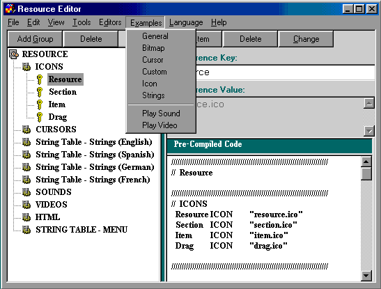



## Resource Editor \- Compiler

### Description

General Resource Tutorial for beginners. Features: resource code sections are well commented including basic examples for beginners; gather resources; create and edit rc file; compile res file; source code demostrations of the baiscs of loading and applying resources during runtime. Also: create folders of modular reusable templates, simple XML (msxml 3.0) with importing, browse for graphics and text files including MSOffice docs to be inserted in res file, String Table Editor with 6 language translation. Source code includes: listBox and treeview features, drag drop, register as ClipBoard Viewer, basic dynamic menus from resource file, webBrowser's BrowseForFolder and HTML-DOM parsing (make eBooks this way). APIs: pathFileExists, PathIsDirectory, SearchTreeForFile, etc.
 
### More Info
 
This is a program designed as a functional Resource Editor and as a tutorial demostrating of the basics of creating and using resource files (xxx.RES). From the executable, there are several examples accessible from the menu that do not work consistently from the vb.ide. Download, compile, and start including resource files with your program.

             |
---                |---
**Submitted On**   |2002-11-04 19:37:06
**By**             |[Synergy](https://github.com/Planet-Source-Code/PSCIndex/blob/master/ByAuthor/synergy.md)
**Level**          |Beginner
**User Rating**    |4.4 (40 globes from 9 users)
**Compatibility**  |VB 5\.0
**Category**       |[Complete Applications](https://github.com/Planet-Source-Code/PSCIndex/blob/master/ByCategory/complete-applications__1-27.md)
**World**          |[Visual Basic](https://github.com/Planet-Source-Code/PSCIndex/blob/master/ByWorld/visual-basic.md)
**Archive File**   |[Resource\_E1492021142002\.zip](https://github.com/Planet-Source-Code/synergy-resource-editor-compiler__1-40416/archive/master.zip)

